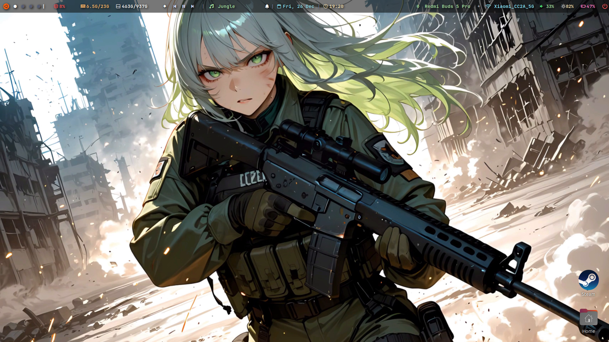
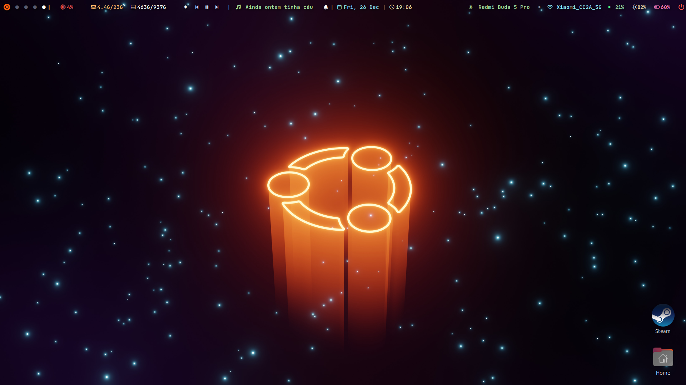
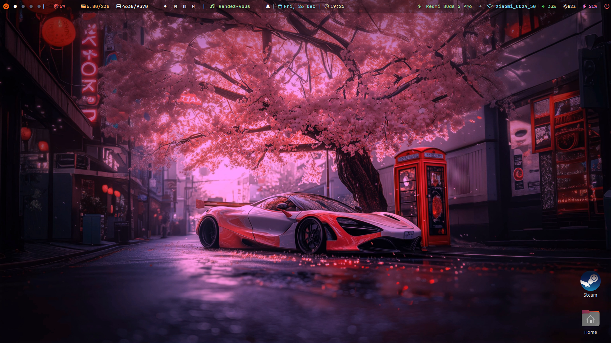
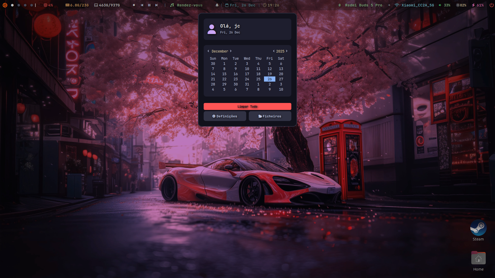
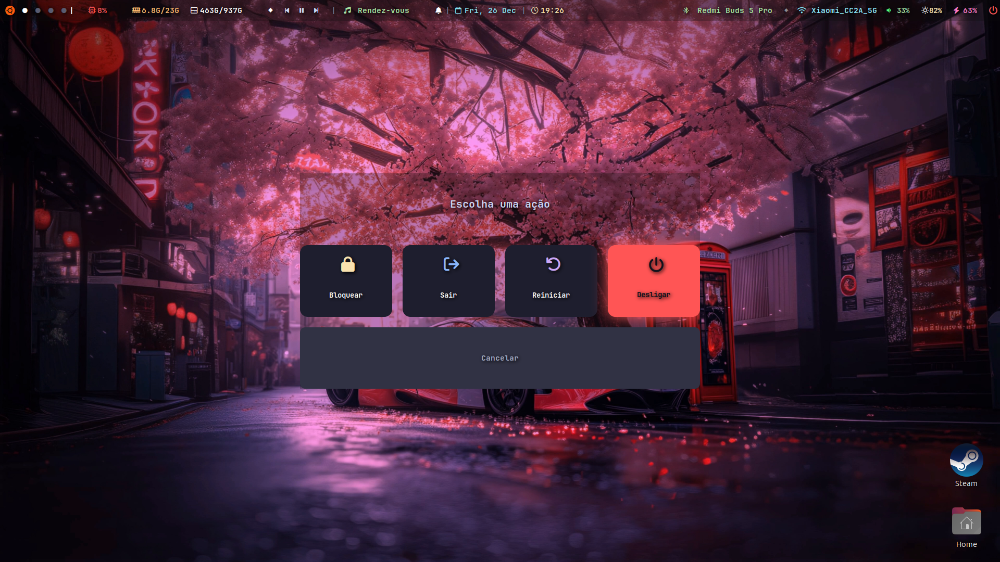

# 🚀 My Custom Eww Bar & Dashboard


A complete and customized setup for **Eww (ElKowars wacky widgets)**.
Includes a dynamic top bar, a persistent notification dashboard, and control popups for Music, Wi-Fi, and Bluetooth.

> **Style:** Minimalist / Dark / Neon Accents.

---

## ✨ Preview











---

## 🛠️ Features

* **🎵 Smart Music Player:**

  * Automatically detects Spotify or other players via `playerctl`.
  * Displays Title/Artist and controls (Play/Pause/Next) directly on the bar.
  * Dedicated popup with cover art (icon) and advanced controls.
  * *Robust Python script that safely ignores read errors.*
* **🔔 Notification Center:**

  * Notification history (you won’t miss anything if you step away).
  * “Clear All” button.
  * Background Python script with a DBus listener.
* **📶 Connectivity:**

  * **Wi-Fi Menu**: Lists networks, shows signal strength and IP address.
  * **Bluetooth Menu**: Lists paired devices, connect/disconnect with one click, and a Power On/Off toggle.
* **💻 System:**

  * CPU, RAM, and Battery monitoring.
  * Calendar and Clock.

---

## 📦 Dependencies

For everything to work correctly, you need to install the following tools on your system (Ubuntu/Debian/Arch):

### 1. Base Tools

* **Eww** (Obviously)
* `python3` (For logic scripts)
* `playerctl` (To control music)
* `socat` & `jq` (Common Eww utilities)
* **Nerd Fonts** (Required for icons. Recommended: *JetBrains Mono Nerd Font*)

```bash
# Ubuntu/Debian
sudo apt install python3 playerctl jq socat
```

---

### 2. Python Libraries

```bash
pip3 install dbus-python
# Or via apt:
sudo apt install python3-dbus
```

---

## 🚀 Installation

1. **Clone the repository:**

```bash
git clone https://github.com/YOUR_USER/YOUR_REPO.git ~/.config/eww
```

2. **Give execution permission to scripts:**

```bash
chmod +x ~/.config/eww/scripts/*
```

3. **Start the bar:**

```bash
eww open bar
```

---

## ⚠️ Important Note About Spotify

If you use Spotify installed via **Snap** (Ubuntu Store), the music widgets **will not work** due to sandbox security restrictions.

**Recommended Solution:** Remove the Snap version and install the official `.deb` version:

---

## ⚙️ Start on System Boot

To automatically start the bar and the notification script:

1. Open **Startup Applications**.
2. Add the following entries:

| Name           | Command                                                |
| -------------- | ------------------------------------------------------ |
| **Eww Daemon** | `eww daemon`                                           |
| **Eww Bar**    | `eww open bar`                                         |
| **Eww Notifs** | `/home/YOUR_USER/.config/eww/scripts/notifications.py` |

---

## 🤝 Contributing

Feel free to fork the project, open issues, or suggest improvements!
